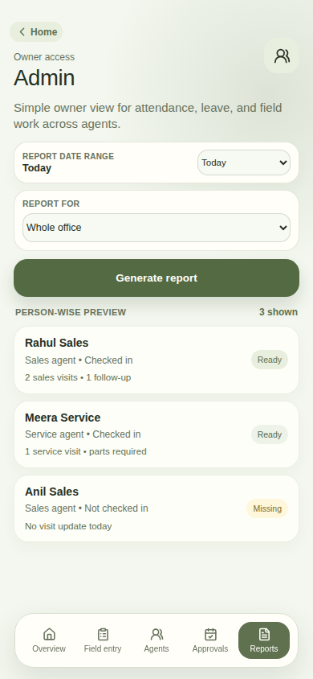
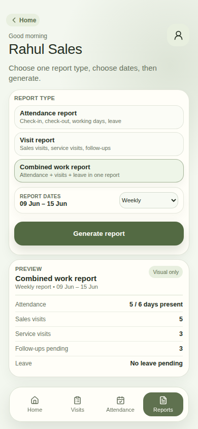

# CrystalBio Field App — Resume / Portfolio Case Study

## Project title
**CrystalBio Field App: Mobile-first field reporting, attendance, leave, admin visibility, and reporting platform**

## One-line resume version
Designed and guided a private mobile-first field operations app for CrystalBio, digitizing sales/service reporting, GPS attendance, leave approvals, admin visibility, PDF reports, and pilot-readiness operations for a controlled client launch.

## Short resume bullets
- Led product direction and UX requirements for a private field-agent reporting app used by sales, service, and admin users.
- Translated scattered field-reporting needs into structured phone workflows: login, check-in/check-out, Sales Visit, Service Visit, Leave Request, Previous Entries, and Admin Reports.
- Defined the approved mobile visual direction: full-screen phone-first UI, calm sage/olive healthcare palette, compact cards, simple labels, and non-technical-user-friendly flows.
- Guided admin workflows for same-day operational visibility, leave approvals, profile/access control, office-assisted field entry, and summary-first reporting.
- Prioritized pilot readiness: private email/password access, unique pilot passwords, backend persistence, backups, monitoring, clean-data handover, and home-screen installation.

---

## Problem
CrystalBio’s field team needed a simpler and more reliable way to report daily sales and service activity. The existing workflow depended on scattered messages, manual follow-ups, and offline updates, which made it difficult for the owner/admin to know:

- who actually checked in for field work,
- which Sales and Service visits happened,
- what follow-ups were still pending,
- which leave requests needed approval,
- which agents were missing updates,
- and whether reports could be downloaded for review.

The users were expected to be non-technical field agents, so the product needed to feel like a simple phone app, not a heavy CRM, dashboard, or spreadsheet system.

---

## My role
I acted as the product/design lead and client-side decision maker for the app. My role was to guide the product logic, field workflows, mobile UX, client pilot scope, and launch-readiness priorities.

### What I guided
- Defined the app as a **mobile-first field companion**, not a desktop dashboard.
- Clarified the core users: field agents, service agents, sales agents, admins, and owners.
- Kept the experience simple for non-technical users.
- Chose private registered email/password login instead of public signup.
- Confirmed that admin users may also go on field and submit Sales/Service entries.
- Required Sales and Service forms to match real field-reporting needs.
- Added attendance, leave, previous entries, reports, and admin approvals into one app journey.
- Pushed for backend reliability, backups, monitoring, and clean handover data before client use.
- Deferred Excel export and automated email/Telegram reporting to a later launch version so the pilot could stay focused.

### UX/design direction I gave
- No phone mockup frame inside the app; it should behave like a real full-screen mobile web app.
- Use a calm sage/olive palette with small warm-yellow accents.
- Avoid heavy dashboard cards, loud colors, generic enterprise styling, and unnecessary explanation blocks.
- Use simple field-agent language: Check in, Sales, Service, Leave, My entries.
- Keep admin screens operational and action-oriented, not report-heavy.
- Keep Request Leave on the Attendance screen, but place it after the main check-in/check-out content.
- Make report screens summary-first and easy to understand.

---

## Product scope

### Agent-side app
- Private login using registered email and password.
- Session persistence so users are not logged out unnecessarily after refresh.
- GPS-based check-in/check-out flow.
- Attendance history.
- Leave request flow.
- Sales visit form with customer, contact, equipment, follow-up, and office-action details.
- Service visit form with issue, work done, parts, next action, and proof/photo support.
- Previous entries screen so agents can view and continue earlier work.
- Agent report preview flow.
- Home-screen install support so the web app can behave like a phone app.

### Admin-side app
- Admin overview for same-day field status.
- Agents screen for live visibility: checked-in users, missing updates, Sales/Service activity, and follow-ups.
- Field Entry screen for admins/back office to submit Sales or Service reports on behalf of an agent.
- Approvals screen for leave decisions.
- Profile/access screen for user seats, setup/reset, activation/deactivation, and access lifecycle.
- Admin reports screen with date range, user/role scope, summary-first output, and PDF export.

### Backend / pilot infrastructure
- Node.js backend API.
- Private email/password authentication.
- Pre-created pilot users with unique passwords.
- JSON-file persistence for controlled pilot usage.
- Health endpoint for uptime checks.
- PDF report endpoint.
- CORS/origin restriction for private hosting.
- Database backup script.
- API monitoring script.
- Clean-test-data script for handover.

---

## Important product decisions

### 1. Web app first, native app later
A mobile web app was chosen for the pilot because it is faster to deploy, easier to update, and can be added to the phone home screen without Play Store/App Store review.

### 2. Private access, no public signup
The app is intended only for approved CrystalBio team members. Users should not self-register publicly. For the pilot, accounts can be created in advance and shared with unique passwords.

### 3. Email automation later
Automated setup/reset emails were kept out of the first frontend launch. The first version focuses on controlled account access; automated emails can be added in the next version.

### 4. Reports now, automation later
PDF report download is included for the pilot. Excel export and scheduled email/Telegram reports are intentionally deferred to a later reporting version.

### 5. Monitoring is high priority, but not admin clutter
Monitoring should track both uptime and real user failures such as login errors, failed form saves, sync/network problems, crashes, and report-generation failures. This should alert the operator/admin separately and should not clutter the admin’s daily workflow screens.

### 6. Backups are high priority
Pilot data must be backed up before and during client testing. Cleaning test data should happen only after a backup is taken.

---

## Current pilot-ready journeys
- Login
- Admin routing
- Session refresh persistence
- Attendance check-in/check-out
- Leave request and admin approval
- Sales field entry
- Service field entry
- Photo/proof attachment
- Previous entries visibility
- Admin overview
- Agents visibility
- Admin Field Entry
- Admin Reports
- PDF report download
- Home-screen install behavior
- Backup and monitoring scripts
- Test-data cleanup script

---

## Screens / visuals in Markdown
Yes, app screens can be shown in a Markdown file. If the image files are committed to the repository, GitHub will display them inline.

Current available screen images:





Additional app screenshots can be added later using the same format:

```md


```

---

## Resume wording options

### Product / UX version
**CrystalBio Field App — Product & UX Lead**  
Led the product and UX direction for a mobile-first field operations app for CrystalBio’s sales and service teams. Defined user journeys for GPS attendance, Sales/Service visit reporting, leave approvals, admin visibility, and PDF reports. Guided the UI toward a calm healthcare-friendly mobile experience for non-technical field agents, while prioritizing private pilot readiness, account access, backups, monitoring, and client handover.

### Business + tech version
**CrystalBio Field App — Field Operations Platform**  
Guided the end-to-end build of a private mobile web app that replaces scattered field reporting with structured Sales/Service entries, GPS attendance, leave approvals, admin visibility, and downloadable PDF reports. Shaped requirements, UX direction, pilot scope, backend reliability needs, and launch-readiness priorities for a 12–13 user client pilot.

### Short resume bullet version
- Guided the design and pilot build of a mobile-first field reporting app for CrystalBio, covering GPS attendance, Sales/Service visit forms, leave approvals, admin visibility, PDF reports, backups, monitoring, and phone home-screen installation.

### Portfolio description
CrystalBio Field App is a mobile-first reporting platform for field sales and service teams. It helps agents check in, submit visit updates, attach proof photos, request leave, and view previous entries. Admins can track field activity, approve leave, manage user access, submit office-assisted entries, and download summary-first reports. The project focused on making a practical, non-technical-user-friendly pilot app that could be installed on phones and tested by the client quickly.

---

## Skills demonstrated
- Product thinking and requirements translation
- Mobile-first UX direction
- Workflow mapping for field teams
- Admin/operations journey design
- Client pilot planning
- Backend reliability prioritization
- QA and launch-readiness thinking
- Scope control and phased rollout planning
- Non-technical user experience design
- Practical handover documentation

---

## Next-version opportunities
- Forgot-password flow completion and setup/reset email automation.
- Automated email sending for account setup/reset/report delivery.
- Scheduled weekly/monthly owner reports.
- Excel export.
- Private object storage for visit photos.
- More production-grade database such as PostgreSQL or PocketBase.
- Dedicated monitoring dashboard or alerting channel.
